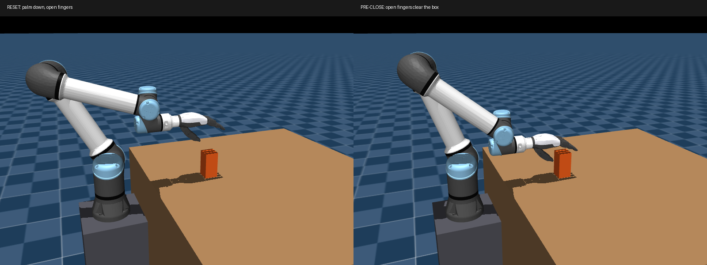

# Palm-down pre-grasp for the fixed-box teacher

Superseded by the [sampled pre-grasp](2026-09-24-pregrasp-sampling.md): the fixed
waypoints and 1.2/0.4 thumb below are no longer used.

Validated 2026-09-24 on MuJoCo native CPU and MuJoCo Warp CPU.

## Implemented change

The teacher now resets with the palm facing down and the long fingers extending
toward the box, matching the requested grasp style. This replaces the previous
vertical-palm pose. The scene, object, actuators and policy task are unchanged.

The hand frame is explicitly defined: local +X (palm-facing direction) maps to
world -Z; local +Y to world -X; local +Z (finger extension) to world +Y. The
`right_hand` origin is the wrist attachment, not the physical palm center.

| Waypoint | Wrist world position, metres |
| --- | --- |
| Reset | (-0.095, 0.290, 1.056) |
| Pre-close | (-0.095, 0.290, 0.956) |
| Lift target | (-0.095, 0.290, 1.116) |

At pre-close, the box center is (0.125, 0.005, 0.190) in the hand frame. Offline
numerical IK fitted wrist position and orientation on the compiled teacher
model. Multiple joint branches were inspected; the positive wrist_2 branch
avoids an upper-arm/wrist_2 collision present in an alternative solution.
`constants.py` stores the calibrated joint angles, with FK and collision tests
checking the resulting geometry. This does not add runtime IK or sampling.

The open pre-shape uses thumb yaw/MCP = 1.2/0.4 rad, index/middle yaw = 0, and
other flexion angles = 0.1 rad. Zero flexion was rejected because the standard
reset clamps it to soft limits and changes the intended opening. The probe's
closing target uses 0.5 rad flexion, retaining yaw and thumb MCP. It is a PD
target, not a joint pose teleported through the object.

Probe timing stays: approach 0–2 s, close 2–4 s, settle until 5 s, lift 5–7 s,
then hold. Joint interpolation is not an exact Cartesian straight line. The
open-hand approach was checked at 41 static samples plus the dynamic rollout.
The policy still controls all 24 joints throughout training.

## Physics measurements

Raw reports: [native](assets/2026-09-24-palm-down-native.json) and
[Warp CPU](assets/2026-09-24-palm-down-warp.json).

| Metric | Native CPU | Warp CPU |
| --- | ---: | ---: |
| Final lift | 0.13895 m | 0.13919 m |
| Continuous stable hold | 3.0 s | 3.0 s |
| Final object linear speed | 0.000640 m/s | 0.000734 m/s |
| Peak hand/object contact depth | 1.275 mm | 1.304 mm |
| Peak object/table contact depth | 1.787 mm | 2.734 mm |
| Peak other robot contact depth | 0 | 0 |
| Approach hand/object contact depth | 0 | 0 |
| Maximum approach horizontal displacement | <0.000001 mm | <0.00002 mm |
| Peak hand normal contact force | 3.758 N | 3.748 N |

Depths and forces are sampled at 20 Hz control boundaries. Native samples after
`mj_forward`; Warp uses its live contact buffer from the last physics substep.
These are not maxima over every 5 ms substep, and normal force is the maximum
single-contact/sensor value, not total force summed over the hand.

The probe now requires both lift/hold success and a rollout audit: <=3 mm
hand/object and object/table penetration; <=1 mm other robot penetration;
<=1 mm approach horizontal displacement; <=0.01 mm approach hand/object
penetration. These are explicit numerical regression tolerances for this soft
contact model. The 3 mm cap is 5% of the box width, not proof of realistic contact
compliance. Initial penetration must remain below 0.01 mm.

Collision classification uses geom body ownership, including unnamed UR5 geoms.
The tests include an alternative IK solution with about 7.8 mm arm self-collision
to verify that the audit actually rejects it.

Validation: `uv run pytest tests/test_grasp_teacher.py -q` — 11 passed;
`make check` — formatting, lint, ty and pyright passed. The CLI probes also
exported the linked JSON reports. No CUDA or policy convergence claim is made.
Warp still warns about unsupported multicontact pairs involving the remaining
cylinders; these collision shapes were not changed by this work.

## Relationship to the original pre-grasp pipeline

The user's outlined pipeline is the right reference for later object-conditioned
initialization: placement, visible surface points, approach frame, roll
candidates, IK selection, finger pre-shape and collision validation. See the
[original teacher reset generation](https://github.com/zdchan/RobustDexGrasp/blob/main/raisimGymTorch/raisimGymTorch/env/envs/allegro_teacher/train.py).

This implementation deliberately establishes one validated palm-down candidate
for one fixed box. It does not yet implement random polar/Beta placement,
single-view ray tracing, ten roll candidates or sibling-environment fallbacks.

When adding that generator, retain these constraints:

- Separate the approach vector, palm normal and finger-extension axis. Allegro
  and rh5dg2 frames and tool offsets are different; a top approach alone does
  not define this palm-down orientation. Do not reuse Allegro's 16-joint preset
  for the 18-joint rh5dg2 hand.
- A visible-surface centroid is an approach reference, not necessarily the
  object's geometric center. Calibrate the rh5dg2 grasp reference and wrist
  transform instead of treating the original 0.25 m reference as a wrist offset.
- IK feasibility is not collision feasibility. Check the complete robot and
  approach path; wrist-angle preference is only one ranking heuristic.
- If copying a valid reset, copy a consistent object pose and joint pose pair.
  A hardcoded fallback also needs collision validation for the sampled object
  placement. Bounded resampling with an explicit failure is preferable to
  silently accepting an invalid pair.
- Lift/hold success remains part of this teacher objective, whereas the original
  teacher's scripted evaluation lift is a different task design.

The earlier [pre-grasp review](2026-09-24-pregrasp-review.md) records the old pose
and its approach penetration; its measurements are preserved for comparison.
