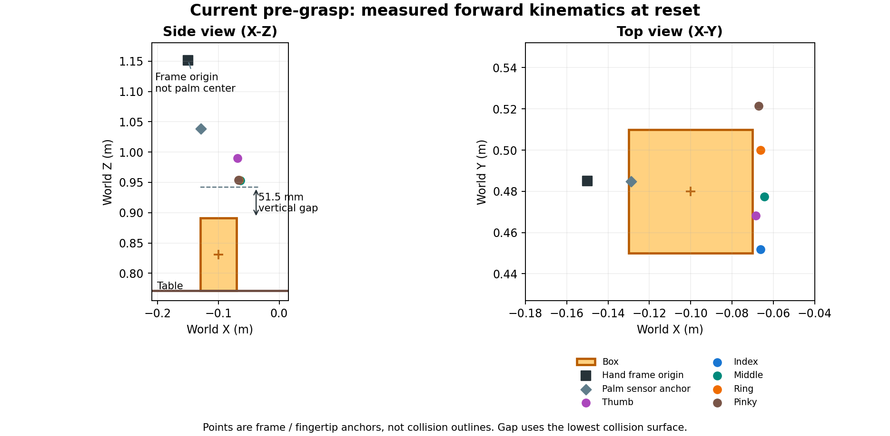

# Pre-grasp review: current baseline versus RobustDexGrasp

Reviewed 2026-09-24, local code at `95a34b058`.

This is the audit of the earlier, vertical-palm baseline. The subsequent
[palm-down change and validation](2026-09-24-palm-down-pregrasp.md) supersedes
its default pose and probe results; the measurements below remain historical.

## Assessment

The current reset is a feasible fixed pre-grasp for this box. It is not an
object-conditioned pre-grasp generator. More importantly, the successful
scripted lift is not evidence of a clean approach: additional measurements
found substantial object displacement and collision penetration before the
script starts closing the fingers. Fix the approach/contact validation before
treating this probe as expert demonstrations or a trustworthy physics baseline
for long training runs.

The training policy uses the reset pose, not the probe's arm trajectory. These
findings do not mean training forcibly executes the problematic approach.

## What the original implementation contributes

The original teacher derives a pre-grasp from the visible object points, chooses
an approach direction, offsets a grasp reference by 0.25 m, corrects for the
hand-to-wrist transform, solves IK and ranks feasible orientations. It also
checks selected arm collisions after a simulation step. See
[train.py](https://github.com/zdchan/RobustDexGrasp/blob/main/raisimGymTorch/raisimGymTorch/env/envs/allegro_teacher/train.py#L365).

The helper samples evenly spaced orientations around the approach axis, folds
their sign by a world-axis condition and computes projected object width.
It is not literally ten independent random orientations. See
[initial_pose_final.py](https://github.com/zdchan/RobustDexGrasp/blob/main/raisimGymTorch/raisimGymTorch/helper/initial_pose_final.py).

The default configuration uses `top=False`, a camera-derived approach direction,
ten orientation samples and a hand-specific offset `[-0.0091, 0, -0.095]`.
Finger initialization is an Allegro-specific 16-joint preset. See
[cfg_reg.yaml](https://github.com/zdchan/RobustDexGrasp/blob/main/raisimGymTorch/raisimGymTorch/env/envs/allegro_teacher/cfgs/cfg_reg.yaml).

Transfer the geometry/IK/clearance procedure, not the Allegro joint vector,
offset or wrist-angle preference. The rh5dg2 has different joint axes, dimensions
and 18 hand joints. Camera coordinates and base transforms are also scene-specific.
For our fixed square box, top-down approach is still a reasonable choice; there
is no need to reproduce perception or multi-object sampling now.

## Measured current reset

Measurements use the actual teacher scene and its rounded collision pads,
native MuJoCo forward kinematics, and the configured keyframe. Units are meters.

| Quantity | Value |
| --- | --- |
| Box center | (-0.100, 0.480, 0.831) |
| Box top / table top | 0.891 / 0.771 |
| `R_hand_palm` frame origin | (-0.150, 0.485, 1.151) |
| Frame rotation | Approximately diag(1, -1, -1) |
| Box center in that frame | (0.050, 0.005, 0.320) |
| Frame-origin to box-center distance | 0.323921 |
| Palm sensor anchor | (-0.128766, 0.484852, 1.038900) |
| Lowest hand collision surface Z | 0.942459 |
| Vertical gap above box top | 0.051459 |
| Fingertip-anchor surface distances | 0.09885, 0.06279, 0.06262, 0.06279, 0.06394 |
| Mean fingertip distance / reach reward | 0.07020 / 0.24562 |
| Initial hand contacts | None |
| All controlled joints within hard limits | Yes |

`R_hand_palm` has zero body offset from the hand root in this asset: its frame
origin is not the center of the palm's contact surface. The sensor anchor is also
only an anchor, not a calibrated grasp center. Comparing 32.4 cm above directly
with the reference's 25 cm would compare different reference points.

The current arm reset is 15 cm above the nominal `GRASP_ARM` frame position.
That 15 cm is a waypoint separation, not the initial fingertip-to-object gap.
`OPEN_HAND` is partially flexed: thumb yaw 1.2 rad, flexion joints mostly 0.4 rad.
The name alone does not establish a collision-free opening around the box.

The figure shows anchor positions, not collision outlines. The vertical gap
uses analytic primitive support extents, not point-anchor distances.

## Newly observed approach problem

The probe interpolates arm joints toward `GRASP_ARM` during 0–2 s, holds the
initial finger target throughout that interval, and starts closing at 2 s.
See [physics_probe.py](../../../src/mjlab/tasks/ur5e_rh5dg2/grasp/physics_probe.py).

In a static diagnostic, imposing `GRASP_ARM + OPEN_HAND` with the object still
at its reset pose produces hand-object overlap up to 36.65 mm. This is an
imposed kinematic configuration, not the penetration measured during rollout.
It must not be reused directly as a closer reset pose.

The actual dynamic rollout confirms that the approach already pushes the box:

| At t = 2.0 s, before commanded finger closing | Native CPU | Warp CPU |
| --- | ---: | ---: |
| Horizontal object displacement | 18.33 mm | 16.95 mm |
| Maximum hand-object contact penetration at sample | 11.93 mm | 9.68 mm |
| Object center Z | 0.81933 m | 0.81284 m |

For Warp CPU specifically:

| Time | Horizontal displacement | Maximum hand normal force | Hand-object penetration | Object-table penetration |
| --- | ---: | ---: | ---: | ---: |
| 0.5 s | 0.00 mm | 0.00 N | 0.00 mm | 0.11 mm |
| 1.0 s | 7.44 mm | 6.08 N | 1.78 mm | 4.59 mm |
| 1.5 s | 12.70 mm | 16.97 N | 6.04 mm | 15.29 mm |
| 2.0 s | 16.95 mm | 32.79 N | 9.68 mm | 19.62 mm |

First sampled hand contact occurs around 0.8 s. Warp uses a 0.1 N threshold;
native records first generated hand-object contact. Penetrations above are
maxima over the relevant generated contacts at each sample, not maxima over
the entire rollout. Force is the maximum normal-force sensor channel, not
the sum over all contacts. Warp derived state/contact timing follows the
environment's substep convention, so these are approximate sampled values.

The object-table depth is large relative to this 6 × 6 × 12 cm box. Small
compliant-contact overlap can be expected, but these measurements need correction
and explicit acceptance limits. Do not attribute everything to pre-grasp alone:
the commanded approach, hand aperture, tracking preload and contact softness
interact. The current initial-penetration and final-hold checks miss this issue.

The earlier lift-and-hold pass remains a true result under its original checks;
it no longer suffices as a general claim that the whole manipulation is
physically acceptable. Likewise, defer behavior-cloning from this trajectory.

## Recommended adaptation for this task

1. Keep the current reset as a reproducible comparison. Represent new pre-grasps
   by object-relative geometry, then solve IK, rather than hand-editing six arm
   joint angles whenever the object moves.
2. Define a rh5dg2 grasp frame and calibrate its transform to the attachment
   frame. With grasp-center offset `c_g` expressed in the wrist frame, compute
   `p_wrist = p_grasp - R_wrist @ c_g`. Do not copy the Allegro offset or assume
   the palm body origin is the palm center.
3. Retain top-down approach initially. Select an open-hand preset and wrist
   alignment whose full collision geometry clears the intended approach path.
   Check thumb opposition and finger aperture geometrically, not only tip
   anchors. Use the box geometry directly; point-cloud reconstruction is not
   needed for this primitive.
4. Choose standoff using closest collision surfaces and a clearance margin.
   The measured 5.15 cm vertical gap is a useful starting reference. Do not
   blindly shorten the 15 cm waypoint separation: that can initialize contact
   or penetration rather than merely make learning easier.
5. For the probe, approach an actually reachable pre-close pose and coordinate
   closing with contact. Then validate lifting. For training, retain full policy
   control; a contact-triggered probe controller must not override policy actions.
6. Extend acceptance to record maximum hand-object and object-table penetration,
   approach object displacement, force peaks and table/self collisions throughout
   rollout, in addition to reset clearance and final hold. Select tolerances
   against object/pad dimensions and re-run on Warp before long training.

Orientation sampling and random pose resets can follow once this deterministic
case is sound. Any closer-pose curriculum must recheck joint limits, collisions,
and settling dynamics for each candidate. No reset, collision or controller
configuration was changed during this review.
