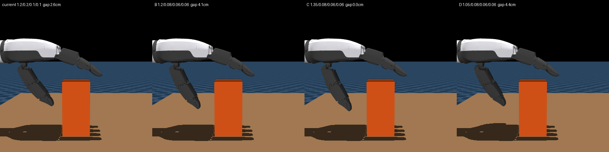
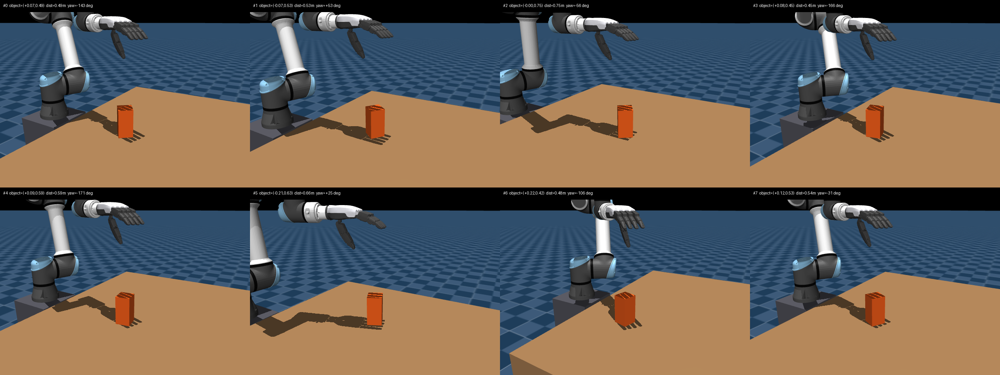
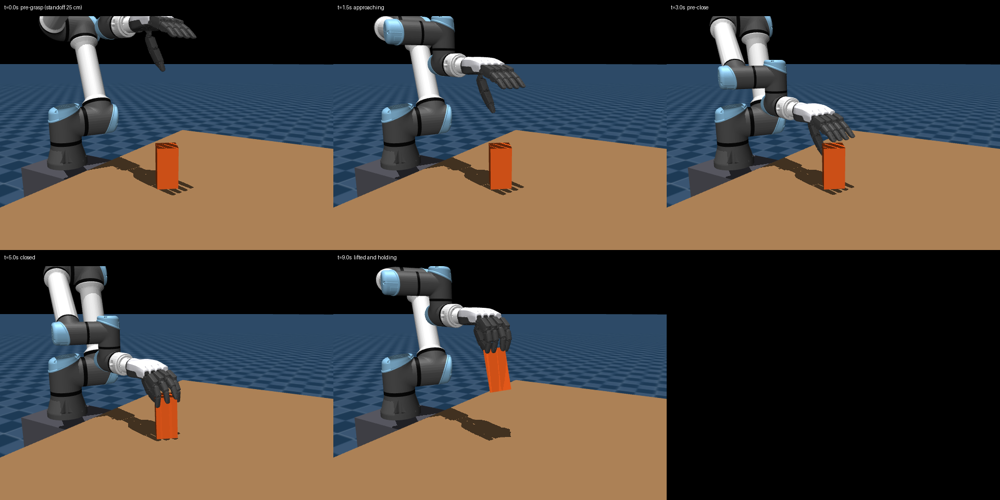

# Sampled pre-grasp after RobustDexGrasp

Validated 2026-09-24 on MuJoCo native CPU and MuJoCo Warp CPU. Supersedes the
fixed palm-down waypoints in [palm-down pre-grasp](2026-09-24-palm-down-pregrasp.md).

## What changed

Every reset now draws an object placement and a matching collision-free
pre-grasp, following the reset loop of the reference
[`allegro_teacher/train.py`](https://github.com/zdchan/RobustDexGrasp/blob/main/raisimGymTorch/raisimGymTorch/env/envs/allegro_teacher/train.py)
and `helper/initial_pose_final.py`. Code: `grasp/pregrasp.py` (sampling, rolls,
IK, collision check) and `grasp/mdp/events.py` (`PregraspReset`).

| Reference step | Implementation |
| --- | --- |
| Polar object placement, 50% uniform / 50% Beta(0.5, 0.5) edge-biased | Same ranges, mirrored to +Y of the base: angle 0.3π–0.7π, distance 0.45–0.75 m, \|x\| < 0.25 m. Play/eval is uniform. |
| Random yaw, height from the lowest point | Yaw uniform in [-π, π]; box rests on the table. |
| Ray-traced visible points from a virtual camera | Box surface points on faces facing the camera at (-0.035, 0.58, 1.531) m (exact for a convex primitive). |
| Approach from the camera or from the top | Top approach, palm down (`TOP_GRASP`). |
| Hand center 0.25 m from the affordance center | `HAND_CENTER` (box center at pre-close, wrist frame) placed 0.25 m along the approach. |
| 10 roll candidates, projection width | 10 finger-axis directions over the half plane facing away from the robot. |
| UR5 IK per candidate, drop infeasible | Damped least squares on the native model, seeded from the collision-free palm-down branch, within the 0.9 soft limits. |
| Score 5 x width + wrist_2 terms, argmin | Same formula; widths >= 0.18 m excluded unless all are. |
| Fixed finger pre-shape | `OPEN_HAND` (18 joints). |
| Replace colliding resets | Colliding samples are rejected: robot-world contact within 5 mm or robot self-penetration. |
| Resample every iteration | 1024 placements solved once at startup (~3 s); resets draw uniformly. |

The reference's sign flip leaves only five distinct roll directions out of ten
thetas; here the ten directions are distinct. The object-displacement penalty is
measured from each env's stored start position rather than a fixed pose.

## Pre-shape

The thumb keeps yaw 1.2 rad for opposition and is opened to mcp/pip/dip
0.08/0.06/0.06 rad, raising the thumb-box gap at pre-close from 2.6 cm to 4.1 cm.
Yaw 1.35 rad collides with the box and yaw 0.9 rad loses opposition.

## Sampled poses

Eight edge-biased pool entries at reset:

Scripted grasp from pool entry #0 (approach 0–3 s, close 3–5 s, lift 6–8 s):

## Physics measurements

The probe starts from the sampled pre-grasp of the nominal placement, approaches
along a straight line (IK every centimetre), closes and lifts 0.16 m vertically.
Raw reports: [native](assets/2026-09-24-pregrasp-native.json) and
[Warp CPU](assets/2026-09-24-pregrasp-warp.json).

| Metric | Native CPU | Warp CPU |
| --- | ---: | ---: |
| Final lift | 0.1384 m | 0.1384 m |
| Continuous stable hold | 3.0 s | 3.0 s |
| Final object linear speed | 0.00067 m/s | 0.00077 m/s |
| Peak hand/object contact depth | 1.32 mm | 1.33 mm |
| Peak object/table contact depth | 1.80 mm | 2.71 mm |
| Peak other robot contact depth | 0 | 0 |
| Approach hand/object contact depth | 0 | 0 |
| Maximum approach horizontal displacement | <0.000001 mm | <0.00002 mm |

The same scripted grasp succeeded on 12 of 12 random edge-biased placements
(yaw -124° to +177°, distance 0.45–0.73 m): lift 0.127–0.141 m, 3.9 s stable,
zero approach displacement.

A 16-env, 3-iteration CPU training run completed with resets from the pool;
object displacement penalty and lift-height metric stayed at zero at the start of
episodes, unlike the fixed pose that pressed the box down.

## Validation

`uv run pytest tests/test_grasp_teacher.py` — 13 passed, plus the slow Warp
probe; fast suite 864 passed; `make check` passed. No CUDA throughput or policy
convergence claim is made.

## Remaining limits

- One box primitive; the visibility test assumes a convex object.
- Top approach only; the side (camera-direction) branch exists but has no
  validated rh5dg2 grasp.
- The pool is sampled once per process. Its size (1024) bounds the number of
  distinct placements seen in training.
- `undesired_contact` dominates early training with random actions; check it
  against `reach` around iteration 200.
