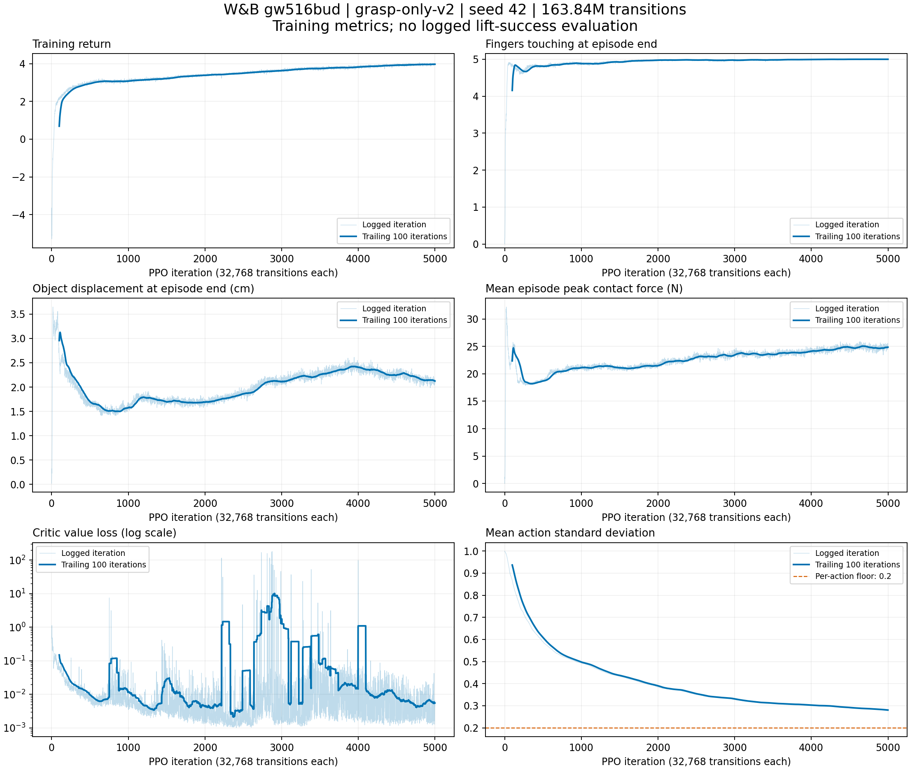

**Phân tích run `gw516bud` — ngày 25/09/2026**

Đã đọc trực tiếp toàn bộ 5.000 dòng history bằng W&B Public API, cấu hình,
summary, git diff, video cuối và các checkpoint 1000, 3000, 4999.
[Run gốc](https://wandb.ai/viethungng2205-ho-chi-minh-city-university-of-technology/dexgrasp-teacher/runs/gw516bud).
Run `2026-09-24_17-58-35_grasp-only-v2` đã finished; commit
`7530c64e53aab7ffe5d59636396131ee6e7cf61d` trùng HEAD lúc phân tích.
File `mjlab.diff` ghi nhận working tree sạch khi train.
Đây là phân tích và đề xuất thí nghiệm; chưa đổi code hoặc cấu hình training.
Các số liệu tổng hợp được lưu trong
[statistics.json](2026-09-25-gw516bud-statistics.json).

**Kết luận từ dữ liệu training**

Policy học rõ rệt cách tiếp cận và duy trì nhiều tiếp xúc trên một hộp.
Tốc độ tăng reward đã chậm lại; chưa có bằng chứng trong history về tỷ lệ
nhấc vật thành công. Chọn checkpoint bằng lift-test trên placement mới
là bước có giá trị cao hơn tăng network hoặc kéo dài run ngay lập tức.



Các ô dưới đây là trung bình 100 iteration kết thúc tại mốc tương ứng,
không phải một điểm cuối hoặc confidence interval giữa nhiều seed.

| Chỉ số | 900–999 | 1900–1999 | 2900–2999 | 3900–3999 | 4900–4999 |
| --- | ---: | ---: | ---: | ---: | ---: |
| Mean episode return | 3,073 | 3,385 | 3,630 | 3,820 | 3,969 |
| Số ngón tiếp xúc cuối episode | 4,881 | 4,973 | 4,976 | 4,993 | 4,998 |
| Độ lệch vật cuối episode, cm | 1,576 | 1,690 | 2,110 | 2,408 | 2,125 |
| Tốc độ vật TB episode, cm/s | 2,077 | 2,195 | 2,235 | 2,319 | 2,274 |
| TB lực tiếp xúc cực đại episode, N | 21,13 | 21,48 | 23,43 | 24,14 | 24,86 |
| Mean action std | 0,498 | 0,390 | 0,331 | 0,303 | 0,280 |

- Reward tăng từ 3,881 ở iteration 4000–4499 lên 3,949 ở 4500–4999:
  tăng 1,75% cho thêm 16,384 triệu transitions. Chưa hoàn toàn plateau,
  nhưng lợi ích biên nhỏ và chưa đo được lợi ích trên success.
- Return và số ngón tiếp xúc tốt dần, trong khi độ lệch vật cuối run cao
  hơn mốc 1000 khoảng 35%, lực peak cao hơn khoảng 18%. Đây là tradeoff
  quan sát được; chưa đủ để kết luận policy khai thác lỗi reward.
- `dropped` và `hand_below_table` bằng 0 trong toàn bộ history. Episode
  dài 80 bước ở giai đoạn cuối. Điều này chỉ phản ánh grasp trên bàn.
  `dropped` kiểm tra vật rơi dưới bàn hoặc ra ngoài bàn, không đo tuột tay
  trong một phép thử nâng vốn chưa diễn ra khi train.
- `Episode_Termination/time_out = 6,453125` ở summary là thống kê số
  termination được logger tổng hợp, không phải 645% hay success rate.
- `contact_force` là trung bình của peak mỗi episode tại các mốc control,
  không phải lực trung bình, tổng lực bàn tay, hay maximum toàn run.

**Reward đang tối ưu điều gì?**

Trong 500 iteration cuối, các `Episode_Reward/*` chính là contact +0,8868,
grip +0,4758, distance −0,2282, displacement −0,0777, arm velocity −0,0324,
object angular velocity −0,0184 và object velocity −0,0148.
Reward manager chia tổng reward thành phần theo thời lượng episode 4 s;
không cộng các giá trị này rồi so trực tiếp với episode return ~3,95.
Chúng còn dùng cách tổng hợp episode khác moving average của runner.

Contact là tỷ lệ link được gán trọng số, không phải tỷ lệ grasp thành công.
Grip thưởng độ lớn lực nằm ngang, có cap 5 N/link và 10 N/link ở thumb;
reward này không trực tiếp chứng minh các lực đối kháng tạo grasp bền.
Không có penalty riêng cho lực hand–object vượt cap. Peak khoảng 25 N
trên vật 80 g đáng kiểm tra bằng trace, nhưng khác đơn vị tổng hợp với
cap nên không thể suy ra trực tiếp lực kẹp dư hoặc lỗi vật lý.
Nên đo thêm lực từng ngón, tải object–table, contact depth và slip.

**PPO có bất ổn cục bộ, nhưng không collapse ở cuối run**

Value loss median toàn run khoảng 0,00495, nhưng có 42/5000 iteration
vượt 1. Mốc 2875 đạt 181,636; mốc 3997 đạt 97,750. Trong 2000–2999,
median chỉ 0,00220 nhưng có 29 spike >1. Learning rate ở nhiều spike
giảm đến 1e-5 qua adaptive KL. Không nên chỉ nhìn đường reward mượt hoặc
value loss cuối 0,00447 để kết luận critic ổn định suốt run.

Đồng thời, 1000 iteration cuối không có value loss >1; median 0,00392,
max 0,10012. History không chứa KL, clip fraction, explained variance,
gradient norm, phân vị returns/advantages hoặc observation outlier.
Chưa xác định được nguyên nhân spike từ các metric hiện có.

**Exploration: floor có tác dụng, nhưng có gradient bị chặn**

Checkpoint cuối: effective mean std 0,27925; arm mean 0,2; hand mean
0,30566; max 0,54033. Có 13/24 action dimensions ở floor 0,2.
Do đó không có bằng chứng exploration suy về 0, và không cần tăng entropy
theo phản xạ chỉ vì entropy coefficient đang bằng 0.

Tuy nhiên, implementation RSL-RL đang dùng `std_param.clamp(min=0.2)`
trong forward. Raw parameters đã thấp hơn 0,2, ví dụ 0,198985; các raw
std của 6 arm joints giữ nguyên giữa checkpoint 3000 và 4999. Khi đã
ở dưới floor, gradient qua clamp bằng 0. Tăng entropy coefficient đơn
thuần không mở lại exploration ở các dimension này. Đây là khác biệt
với việc project parameter về floor sau optimizer step của reference.
Nếu thí nghiệm đòi hỏi exploration tăng trở lại, cần sửa cơ chế bound
hoặc tái khởi tạo std và optimizer state liên quan một cách có kiểm soát.
Chưa có bằng chứng việc chạm floor đang làm giảm lift success.

**Đối chiếu RobustDexGrasp**

Cấu hình thực của run: seed 42, 512 envs × 64 rollout steps; 5000 updates
= 163,84 triệu transitions, khoảng 4,55 giờ trên RTX 5090. Control 0,05 s,
episode grasp 4 s, actor/critic ELU 128×128, input 258, action 24,
gamma 0,996, lambda 0,95, initial LR 3e-4, adaptive KL 0,01,
4 epochs × 4 mini-batches, entropy coefficient 0, std floor 0,2.

Reference cũng train grasp-only và có nhánh evaluation dùng commanded
arm lift, kiểm tra vật lên >10 cm. Default `eval_during_training` trong
config công khai đang tắt. Vì vậy việc train không có lift reward không
phải tự nó là một lỗi so với phương pháp gốc.
[Teacher training code](https://github.com/zdchan/RobustDexGrasp/blob/main/raisimGymTorch/raisimGymTorch/env/envs/allegro_teacher/train.py).

Reference dùng control 0,2 s, 70 grasp steps, input 153/action 22, Allegro;
repo hiện tại dùng RH5DG2, một hộp 6×6×12 cm, 80 g, top grasp, pregrasp
standoff 6 cm. Không so reward hoặc success trực tiếp với benchmark
đa vật thể của paper.
[Reference config](https://github.com/zdchan/RobustDexGrasp/blob/main/raisimGymTorch/raisimGymTorch/env/envs/allegro_teacher/cfgs/cfg_reg.yaml).

Một khác biệt quan trọng: reference đặt target bằng current q + action
đã scale, còn repo tích lũy vào previous target và giới hạn lead quanh q.
Scale hiện tại arm/hand = 0,01/0,03 rad/bước, reference = 0,005/0,015.
Không thể coi hai controller tương đương hay copy nguyên hệ số giữa chúng.
[Reference controller](https://github.com/zdchan/RobustDexGrasp/blob/main/raisimGymTorch/raisimGymTorch/env/envs/allegro_teacher/Environment.hpp).

Review `2026-09-24-teacher-model-review.md` mô tả phiên bản cũ có
policy-controlled lift/hold, 259 inputs và chưa có std floor. Không dùng
các nhận xét đó như mô tả của run này.

**Thứ tự công việc đề xuất**

1. Đánh giá checkpoint 1000, 2000, 3000, 4000, 4999 trên cùng một tập
   placement mới và cùng random seed; deterministic mean actions.
   Bắt đầu 512 trials, checkpoint tốt nhất xác nhận trên >=1024 trials
   độc lập, báo Wilson 95% CI. Khoảng 1024 trials cho sai số tệ nhất
   xấp xỉ ±3 điểm phần trăm; tập validation chọn model cần tách test.
   Chọn checkpoint bằng lift success, không bằng training return.
2. Log evaluation mỗi 250–500 updates: success cuối lift, slip/drop sau
   lift, lift height, contact thumb + ngón đối diện, displacement XY,
   force p50/p95/max, và success theo vùng gần/xa/rìa workspace.
   Đo riêng success nâng >10 cm và success giữ ổn định 3 s.
3. Nếu lift kém dù grasp metrics tốt, phân loại bằng video và trace:
   grasp không đối kháng, lực kẹp thiếu/dư, hand mở khi vật lên,
   hay quỹ đạo arm script làm tuột. Thử giữ nguyên finger target cuối
   grasp trong lift để phân biệt grasp cơ học yếu với policy hand phản
   ứng không tốt ngoài phân phối train. Đây là diagnostic variant,
   cần báo riêng với evaluation mặc định.
4. Trước một run dài mới, bổ sung KL, PPO clip fraction, explained
   variance, gradient norm trước clip, return/advantage p99/max,
   normalized observation max và action saturation trước wrapper clip.
   Nếu spike lặp lại, so baseline adaptive LR với fixed LR 1e-4 hoặc
   adaptive LR có trần 3e-4; đây là candidate, chưa phải giá trị tối ưu.
   Cùng transition budget, các seed 42/43/44 để xác nhận lựa chọn.
5. Nếu lực cao hoặc đẩy vật là failure mode, ablate riêng displacement
   weight −5 → −10, hoặc thêm excess-force penalty với ngưỡng từ probe
   và khả năng actuator; không tăng grip weight ngay. Tránh thay nhiều
   reward đồng thời. Giữ một baseline gốc để so lift success và slip.
6. Khi grasp thành công trên placement mới, mở rộng từ pool cố định
   1024 poses sang pool lớn hơn hoặc refresh; sau đó randomize kích
   thước, mass, friction, pose và gain theo khoảng đã kiểm chứng bằng
   physics probe. Test trên poses/objects độc lập. Đổi kích thước phải
   cập nhật cả geometry distance đang dùng BOX_SIZE cố định.

Chỉ khi diagnostics chỉ ra credit assignment kém mới ưu tiên gamma
0,999 hoặc rollout 128. Với grasp 4 s hiện tại, gamma 0,996 cho discount
cuối episode ~0,726; khác bài toán lift/hold 12 s trong review cũ.
Giữ mạng 128×128 trước; dữ liệu hiện có chưa chứng minh thiếu capacity.
Nếu cần thêm scripted-lift data vào training, phải tách/gate penalty
3D object displacement và velocity ở pha lift để tránh phạt động tác
nâng mong muốn. Đây là thay đổi objective, cần run và baseline riêng.

**Giới hạn evaluator hiện tại**

`evaluate.py` chạy grasp 4 s + lift-test 4 s, arm ramp 3 s; success chỉ
kiểm tra object height >10 cm tại bước cuối và không early terminate.
`HOLD_TIME = 3` và `stable_hold()` không được evaluator gọi. Vì vậy
success của evaluator này không có nghĩa giữ vật ổn định 3 s. Muốn đo
tiêu chí đó, kéo dài pha sau ramp đủ 3 s và tích lũy thời gian liên tục
đạt height/contact/no-table-contact/velocity requirements.

CLI chưa có `--seed`; để so checkpoints cần đặt `cfg.seed` trước khi
khởi tạo env hoặc lưu và replay cùng placement pool. Sampling uniform
ở đây là uniform theo tham số polar angle/radius rồi lọc IK-feasible,
không phải uniform diện tích bàn. Pool train cố định 1024 placements
có thể làm metric trong train lạc quan; overfit chưa được đo.
Nếu episode early terminate, evaluator có auto-reset; các metric phụ
ở cuối có thể chứa episode sau reset dù success đã mask failures.

Lệnh chạy evaluator hiện có trên GPU training:

```sh
uv run python -m mjlab.tasks.ur5e_rh5dg2.grasp.evaluate \
  --wandb-run viethungng2205-ho-chi-minh-city-university-of-technology/dexgrasp-teacher/gw516bud \
  --wandb-checkpoint model_4999.pt --num-envs 512 --device cuda:0
```

Lệnh này cho phép thử lift hiện tại, chưa bổ sung seed cố định hoặc
tiêu chí stable-hold 3 s nói trên. Video W&B cuối được kiểm tra chỉ dài
4 s và ghi trong môi trường training grasp-only, không phải lift-test.

Đã thử evaluator với `model_4999.pt`, 32 envs và `--device cpu` trên Mac.
Checkpoint và môi trường khởi tạo được, nhưng phép thử chưa trả kết quả
sau hơn 7 phút nên đã chủ động dừng. Không có lift success mới được
báo cáo từ lần chạy này; không diễn giải việc dừng thành policy thất bại.

**Bổ sung: kiểm chứng lift-test và failure mode (25/09/2026)**

Lift-test `model_3800.pt`, 64 placement uniform, CPU: success 3,1% (2/64),
lift trung bình −1,0 cm, cả 5 ngón tiếp xúc cuối pha grasp, không early
termination.

Rollout 32 env, pha grasp (object–table là lực contact lớn nhất mỗi cặp):

| Chỉ số | model_1000 | model_4999 |
| --- | ---: | ---: |
| Lực object–table cuối grasp, trung vị (vật nặng 0,78 N) | 42,5 N | 47,7 N |
| Lực object–table peak, trung vị | 72,3 N | 85,2 N |
| Env có lực object–table > 5 N | 100% | 100% |
| Độ nghiêng vật, trung vị | 16,1° | 11,9° |
| Độ sâu đầu ngón dưới mặt trên hộp (cái, trỏ, giữa, nhẫn, út), trung vị | 1,2 / 3,9 / 0,3 / 1,1 / 2,2 cm | 1,8 / 3,5 / 0,3 / 1,1 / 2,4 cm |

Rollout cận cảnh 1 env của model_3800: lòng bàn tay và các ngón úp lên đầu
hộp, ép hộp xuống bàn 30–70 N suốt pha grasp. Khi arm được nâng, hộp mất lực
ép, lên 6,7 cm rồi tuột; không ngón nào còn tiếp xúc.

Kết luận: policy khai thác reward bằng cách ép vật xuống bàn. Contact và
fingers_in_contact cao nhờ tiếp xúc do ép; displacement và velocity thấp vì
vật bị ghim. Hành vi có từ iteration 1000 và lực tăng dần đến cuối run, nên
train lâu hơn, tăng displacement weight hay chỉnh PPO không giải quyết.

Thay đổi tiếp theo (commit sau run này): pre-grasp tại pre-close (standoff
0–3 cm), penalty tải object–table vượt trọng lượng vật (−1 mỗi 10 N), grip
chỉ thưởng lực ngang thumb đối kháng các ngón còn lại, std floor chiếu sau
update như reference, và lift-test 256 env ghi vào W&B ở mỗi checkpoint.
